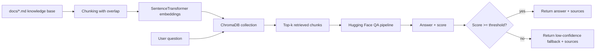

# Machine Learning Interview RAG Assistant

Retrieval-Augmented Generation (RAG) study assistant for machine learning interview preparation.

## Technologies Used

- Python
- ChromaDB
- Sentence Transformers
- Hugging Face Transformers
- PyTorch
- Jupyter Notebook

## 30-Second Overview

- Business problem: interview candidates need fast, source-grounded answers across broad ML topics.
- Technical approach: Markdown knowledge base -> chunking -> Sentence Transformer embeddings -> ChromaDB retrieval -> Hugging Face extractive QA.
- Scope: notebook-first prototype focused on retrieval quality, confidence gating, and source attribution.
- Status: implemented and evaluated in [ml_interview_rag_assistant.ipynb](ml_interview_rag_assistant.ipynb).

## Engineering Scope For Interviews

This project demonstrates practical engineering work relevant to software, AI/ML, solutions engineering, and customer engineering interview loops:

- Data and content pipeline design for retrieval systems.
- Architecture tradeoff communication (quality vs complexity, prototype vs production).
- Model integration and confidence gating for safer outputs.
- Clear documentation of implementation limits and incremental next steps.

## Architecture



## What Is Implemented

- Knowledge base in [docs/](docs/) with 8 ML-topic documents:
  - ML fundamentals
  - Data preprocessing
  - Feature engineering and encoding
  - Supervised learning
  - Model evaluation
  - Neural networks and deep learning
  - Computer vision
  - NLP, embeddings, and RAG
- End-to-end RAG workflow in [ml_interview_rag_assistant.ipynb](ml_interview_rag_assistant.ipynb):
  - Markdown document loading
  - Configurable chunking with overlap
  - Embedding generation
  - ChromaDB vector retrieval
  - Extractive QA answer generation
  - Confidence-based fallback behavior
  - Source attribution in responses
- Evaluation implemented in the notebook:
  - 22 test questions across topic and edge-case categories
  - 10 high-confidence and 12 low-confidence outputs
  - 4/4 edge-case questions correctly triggered low-confidence fallback

## Engineering Decisions (And Why)

1. Notebook-first implementation
  - Keeps each stage observable and reviewable for technical interviews.

2. Markdown as source-of-truth
  - Separates domain content from code for maintainability.

3. ChromaDB for vector retrieval
  - Lightweight local vector store suitable for rapid prototyping.

4. Extractive QA baseline
  - Uses a simpler baseline to make retrieval behavior easier to inspect.

5. Confidence thresholding
  - Prevents unsupported answers by returning explicit fallback text.

## What This Project Is Not

- Not a production deployment.
- Not an API/web service package.
- Not a benchmark-optimized model comparison study.

## Repository Structure

```text
ml-interview-rag-assistant/
├── ml_interview_rag_assistant.ipynb
├── README.md
├── requirements.txt
├── .gitignore
├── docs/
│   ├── 01_ml_fundamentals.md
│   ├── 02_data_preprocessing.md
│   ├── 03_feature_enginering_encoding.md
│   ├── 04_supervised_learning.md
│   ├── 05_model_evaluation.md
│   ├── 06_nueral_networks_deep_learning.md
│   ├── 07_computer_vision.md
│   ├── 08_nlp_rag.md
│   └── README.md
```

Notes:
- A few file names preserve original course naming (including spelling) for consistency with existing project artifacts.
- Submission/export archive files are intentionally ignored and not part of the runnable source pipeline.

## Setup

### 1. Create and activate a virtual environment

Windows PowerShell:

```powershell
python -m venv .venv
.\.venv\Scripts\Activate.ps1
```

macOS/Linux:

```bash
python3 -m venv .venv
source .venv/bin/activate
```

### 2. Install dependencies

```bash
pip install -r requirements.txt
```

The [requirements.txt](requirements.txt) file pins `transformers==4.52.4` because this notebook uses the `question-answering` pipeline with that validated version.

### 3. Launch Jupyter

```bash
jupyter notebook
```

Open [ml_interview_rag_assistant.ipynb](ml_interview_rag_assistant.ipynb) and run cells in order.

## Review Path

1. Read this README for scope and decisions.
2. Open [ml_interview_rag_assistant.ipynb](ml_interview_rag_assistant.ipynb) and inspect:
  - Chunking implementation
  - Retrieval setup
  - `RAGAssistant` class
  - Comprehensive testing and analysis sections
3. Scan [docs/](docs/) to evaluate domain coverage and source quality.

## Engineering Discussion Topics

- Why thresholding was introduced and how it affected edge-case behavior.
- Why extractive QA was acceptable for a baseline and where it falls short.
- How source attribution supports auditability and trust.
- Where this notebook architecture would be split for production (ingestion, retrieval service, evaluation harness).

## Limitations

- Answer generation uses an extractive QA model, which can return short phrases.
- No automated unit/integration test suite in this version (evaluation is notebook-based).
- Single-notebook implementation; packaging and service layers are future work.

## Potential Next Improvements

- Add automated tests for chunking and retrieval behavior.
- Add experiment tracking and repeatable evaluation scripts.
- Compare extractive QA baseline with a generative answer model.

## Portfolio Context

This repository demonstrates applied ML engineering fundamentals for a RAG workflow: data preparation, retrieval pipeline construction, model integration, confidence handling, and technical documentation.